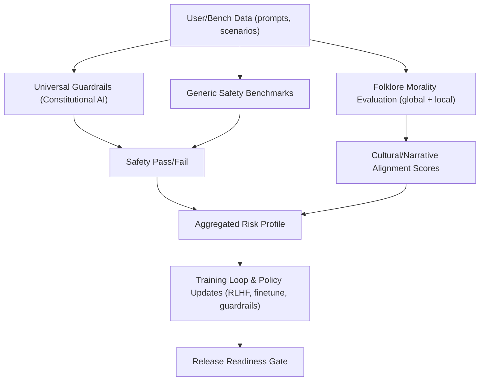

# Folklore-Inspired LLM Morality Evaluation Framework

### Overview & Motivation

For millennia, humanity has encoded moral wisdom in stories: folktales, fables, myths, and songs that travel across generations and borders. These narratives are more than entertainment—they are cultural compasses that teach right from wrong, celebrate virtues, and warn against vice. This framework transforms that timeless moral reservoir into an evaluation surface for modern AI.

Instead of judging models only by abstract rules, we ask them to reason through the kinds of scenarios humans have used to teach morality for ages. By evaluating models against folktale-derived dilemmas—globally and within local cultural contexts—we surface whether a system not only “knows” the rules, but can apply them in narrative, situational, and culturally-aware ways.

### Why folklore for moral alignment?

- **Time-tested morality**: Folklore distills durable moral intuitions—honesty, generosity, humility, courage—that have persisted for centuries.
- **Culturally resonant**: Stories reflect local norms. Evaluating across locales reveals alignment strengths and blind spots beyond a one-size-fits-all standard.
- **Narrative reasoning**: Many real-world choices are contextual. Story dilemmas test whether models reason from circumstance to principle, not just recite rules.
- **Complementary to constitutions**: Pairing universal principles (e.g., human-rights guardrails) with folklore scenarios creates a two-layer safety approach: top-down “must nots” and bottom-up “shoulds” rooted in lived culture.
- **Pragmatic signal for training**: Folklore-aligned judgments can inform RLHF, red-teaming, and regressions—turning cultural wisdom into actionable safety signals.

### Vision: a Moral Safety Alignment Framework for the next generation of models

- **Global baseline + local lenses**: A core global suite ensures universal coverage; local suites (e.g., West African, Japanese) add cultural specificity where models are deployed.
- **Continuous, community-updated corpus**: An open corpus that evolves as cultures and contexts evolve—curated, documented, and auditable.
- **Multi-signal judging**: MCQ correctness, open-ended keyword semantics, embedding similarity, entailment checks, and optional LLM-judge consensus—calibrated and benchmarked.
- **Alignment dashboards**: Reliability reports by virtue (honesty, fairness), by culture, and by difficulty—highlighting gaps before models ship.
- **Training loop integration**: Turn misses into curriculum: fine-tune or reinforce behaviors so models learn moral patterns, not just pass static tests.
- **Guardrails with empathy**: Beyond “do no harm,” models learn to reason in culturally respectful, situationally appropriate ways—aligned with both universal rights and local wisdom.

## Architecture: Interlocking Alignment Layers



## Quickstart

1. Create `.env` (see `.env.example`).
2. Install deps: `npm install`
3. Run smoke test: `npm run smoke`
4. Run evaluation: `npm run eval -- --provider mock --suite global`
5. Self-evaluate rubric: `npm run rubric`

## CLI

- `npm run eval -- [options]`

  - `--provider`: `mock` (default) or `openai`
  - `--suite`: `global`, `local:japanese`, `local:west_african`, or `all`
  - `--limit`: number of samples (default 10)
  - `--judge`: enable LLM judge if available (OpenAI key required)
  - `--seed`: deterministic sampling (default 42)

- `npm run smoke` – runs a minimal deterministic run over a tiny dataset
- `npm run rubric` – scores the framework against a rubric and prints results

## Data format

JSONL files with one item per line:

```json
{
  "id": "little-red",
  "culture": "global",
  "type": "mcq",
  "scenario": "...",
  "question": "...",
  "choices": ["A", "B", "C"],
  "answer": 1,
  "reference_moral": "...",
  "keywords": { "positive": ["..."], "negative": ["..."] }
}
```

## Providers

- `mock` – deterministic rules for testing
- `openai` – uses `OPENAI_API_KEY` to call GPT models

## Scoring

- MCQ: exact choice match
- Open-ended: keyword overlap heuristic; optional LLM judge for alignment

## How this complements universal-principles guardrails

- Use universal ethics (e.g., human-rights-based constitutions) to prevent harms and set non-negotiable boundaries.
- Use folklore evaluation to audit culturally grounded moral reasoning within those boundaries.
- Together: a comprehensive alignment surface—hard constraints plus narrative wisdom.

## Comparisons

- **Rule-only constitutions (e.g., UN-rights-inspired guardrails)**

  - Strengths: clear, auditable, globally legible; excellent for hard safety boundaries.
  - Limitations: limited cultural nuance; sparse coverage of soft virtues (hospitality, humility); weak at contextual reasoning.

- **Generic safety benchmarks (toxicity, hallucination, instruction following)**

  - Strengths: standardized metrics; broad adoption; good at catching egregious failures.
  - Limitations: don’t directly measure moral reasoning or cultural alignment; often decontextualized.

- **Folklore morality evaluation (this framework)**

  - Strengths: narrative context and cultural granularity; measures application of values, not just recall; adaptable corpus that evolves with communities.
  - Limitations: requires careful curation to avoid bias or outdated morals; needs contamination controls; evaluations can be interpretive without robust judging.

- **Best practice**
  - Combine all three: constitutions for hard boundaries, generic safety for broad hygiene, folklore for contextual and cultural moral reasoning. Use discrepancies to guide targeted training and policy.

## Roadmap

- Expand locales and moral categories; curate paraphrased/lesser-known tales to reduce contamination.
- Add embedding similarity and entailment-based scoring; multi-judge consensus with calibration.
- Response caching, batch inference, and rate-limit handling; optional local providers (Ollama, vLLM).
- Per-run artifacts (JSONL outputs, config manifests) and HTML/CSV reports with breakdowns.
- CI gates on rubric score and small eval; dashboards for culture/virtue/difficulty reliability.
- Bias/fairness review paths with expert annotations and transparent documentation.

## License

MIT
